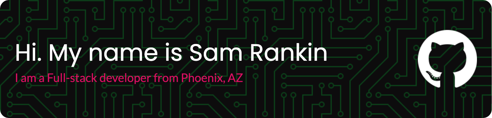

 

<h2>About me</h2>

From the moment I coded my first microsite in 2010 to now, I have yet to lose the wonder that coding has given me. To be able to string together characters and create these rich, interactive experiences on screen feels like I’m casting a spell. What’s even more amazing is how these digital experiences allow people to access things they might not have without it, things like education, products, and community.

As a web developer, I see it as my responsibility to make my work as **beautiful, intuitive, and accessible** as I possible can, no matter the screen size.

## Languages and Tools

     
       
  

## Github Stats

<table border="0"  rules="none" width="100%">
	<tr>
		<td valign="top" width="50%">
			
		</td>
		<td valign="top" width="50%">
			
		</td>
	</tr>
</table>

